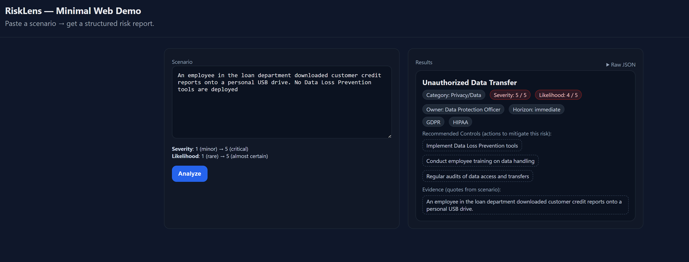

## About

**RiskLens** is a lightweight risk assessment application that uses a Large Language Model (LLM) to transform unstructured, free-text scenarios into a structured, actionable risk report. 

Currently, the gpt-4o-mini model is accessed via the OpenAI API.

Designed for industries like healthcare, finance, and compliance-heavy sectors, the tool automatically extracts:  

- **Risk title and category**  
- **Severity** *(1–5 scale)* and **Likelihood** *(1–5 scale)*  
- **Recommended controls** and **supporting evidence**  
- **Relevant regulations/standards** (e.g., HIPAA, GDPR, SOX)  
- **Responsible owner** and **time horizon** for mitigation  

The project includes:  

- **Backend:** FastAPI app exposing REST endpoints (`/analyze`, `/health`)  
- **Frontend:** Minimal HTML/JavaScript interface served directly from FastAPI  
- **Data contract:** Pydantic models ensuring consistent API responses  
- **LLM integration:** OpenAI API for risk extraction and formatting  

**RiskLens** can be used directly via the browser interface or integrated into other systems through its API, making it suitable for demos, prototyping, and extension into production-grade workflows.  

